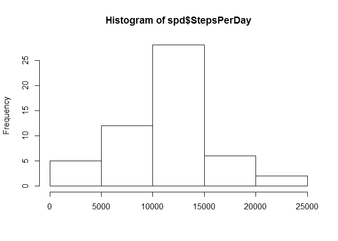
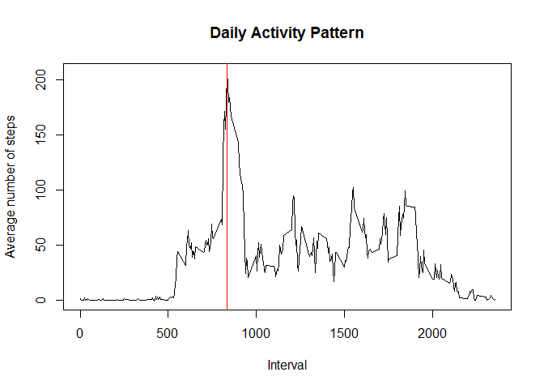
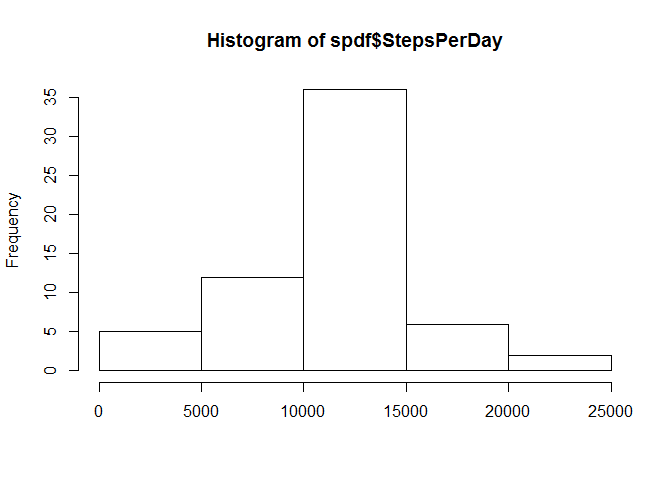
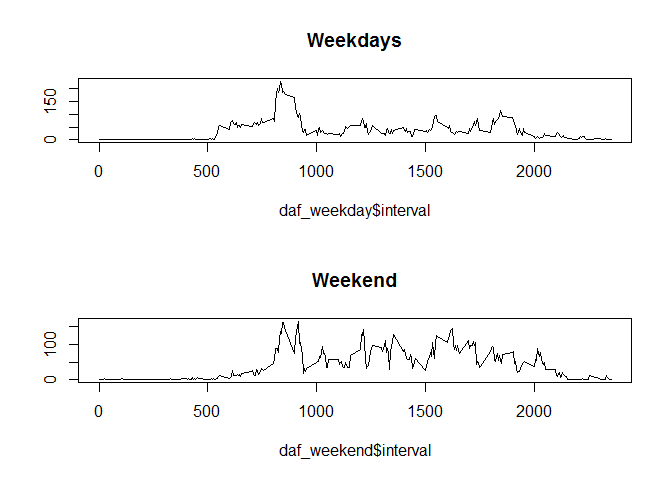

# Reproducible Research: Peer Assessment 1
Yury Kozhin  


###Loading and preprocessing the data
&nbsp;&nbsp;&nbsp;The repository **RepData_PeerAssessment1** was forked and cloned to the local F: drive with Git Bash *clone* command. Following code chunk reads comma separated data from zipped file to the variable **data**. First assessment task suppose to ignore missed values so we formed **NoNAdata** data set using *dplyr* filter function.


```r
        library(dplyr)        
        setwd("F:\\RepData_PeerAssessment1")
        data <- read.csv(unz("activity.zip","activity.csv"))
        NoNAdata <- filter(data,!is.na(steps))        
        summary(data)
```

```
##      steps                date          interval     
##  Min.   :  0.00   2012-10-01:  288   Min.   :   0.0  
##  1st Qu.:  0.00   2012-10-02:  288   1st Qu.: 588.8  
##  Median :  0.00   2012-10-03:  288   Median :1177.5  
##  Mean   : 37.38   2012-10-04:  288   Mean   :1177.5  
##  3rd Qu.: 12.00   2012-10-05:  288   3rd Qu.:1766.2  
##  Max.   :806.00   2012-10-06:  288   Max.   :2355.0  
##  NA's   :2304     (Other)   :15840
```

###What is mean total number of steps taken per day?
&nbsp;&nbsp;&nbsp;To analyze the number of steps taken per day we formed **spd** data set. Columns *date* and *steps* were selected from **NoNAdata**. Then **spd** was grouped and summarized by *date*. The resulting number of steps per day can be found at **spd$StepsPerDay** vector.

```r
        spd <- select(NoNAdata,date,steps)
        spd <- group_by(spd,date)
        spd <- summarise(spd,sum(steps))
        names(spd)[2] <- "StepsPerDay"
        head(spd)
```

```
## Source: local data frame [6 x 2]
## 
##         date StepsPerDay
## 1 2012-10-02         126
## 2 2012-10-03       11352
## 3 2012-10-04       12116
## 4 2012-10-05       13294
## 5 2012-10-06       15420
## 6 2012-10-07       11015
```

```r
        mean(spd$StepsPerDay)
```

```
## [1] 10766.19
```

```r
        median(spd$StepsPerDay)
```

```
## [1] 10765
```

```r
        hist(spd$StepsPerDay, xlab = "")
```

 

As we see the mean and median values are close to each other that confirms that distribution of steps per day is not skewed and looks like normal distribution.

### What is the average daily activity pattern?
&nbsp;&nbsp;&nbsp;Here we visualize the daily activity pattern. We ignore missing values the same way we did in previous task. Columns *interval* and *steps* were selected to the **da** data set. Then **da** was grouped and summarized by *steps*. Average amount of steps were calculated for every interval.


```r
        da <- select(NoNAdata,interval,steps)
        da <- group_by(da,interval)
        da <- summarise(da,mean(steps))
        names(da)[2] <- "StepsPerInterval"
        plot(da$interval,da$StepsPerInterval,type = "l",main = "Daily Activity Pattern", xlab = "Interval", 
                                    ylab = "Average number of steps")
        interval_with_maximum_steps <-filter(da,StepsPerInterval==max(da$StepsPerInterval))$interval
        abline(v=interval_with_maximum_steps,col="red")
```

 

```r
        interval_with_maximum_steps
```

```
## [1] 835
```

We see that maximum activity happens at 8:35.

### Imputing missing values
&nbsp;&nbsp;&nbsp;Now we stop working with **NoNAdata** and will create **FilledNAData** data set which will be copy of **data** but with filled missing values. Every missing value will be replaced with the average number of steps for the current interval. Let's calculate the number of rows with missing values. 

```r
        missing_values_qty <- nrow(subset(data, is.na(steps)))
        missing_values_qty  
```

```
## [1] 2304
```
The number corresponds to the result of the summary function shown in the beginning of this report. 

Here we fill the missing values. In the result **FilledNAData** does not have the missing values.

```r
        FilledNAData <- data
        for (i in 1:nrow(FilledNAData)){
            if (is.na(FilledNAData[i,1])){
                   FilledNAData[i,1] <- mean(FilledNAData$steps[FilledNAData$interval==FilledNAData[i,3]],na.rm=TRUE)
            }
        }
        summary(FilledNAData)
```

```
##      steps                date          interval     
##  Min.   :  0.00   2012-10-01:  288   Min.   :   0.0  
##  1st Qu.:  0.00   2012-10-02:  288   1st Qu.: 588.8  
##  Median :  0.00   2012-10-03:  288   Median :1177.5  
##  Mean   : 37.38   2012-10-04:  288   Mean   :1177.5  
##  3rd Qu.: 27.00   2012-10-05:  288   3rd Qu.:1766.2  
##  Max.   :806.00   2012-10-06:  288   Max.   :2355.0  
##                   (Other)   :15840
```

Let's make a histogram of the total number of steps taken each day and calculate the mean and median total number of steps taken per day using **FilledNAData**.

```r
        spdf <- select(FilledNAData,date,steps)
        spdf <- group_by(spdf,date)
        spdf <- summarise(spdf,sum(steps))
        names(spdf)[2] <- "StepsPerDay"
        mean(spdf$StepsPerDay)
```

```
## [1] 10766.19
```

```r
        median(spdf$StepsPerDay)
```

```
## [1] 10766.19
```

```r
        hist(spdf$StepsPerDay, xlab = "")
```

 

As we see the mean value remains the same but median value is changed and become equal to the mean value. This is the result of filing the missing values. The distribution became more symmetric according to the mean.


### Are there differences in activity patterns between weekdays and weekends?
&nbsp;&nbsp;&nbsp;Here we are going to modify **FilledNAData** adding factor variable *daytype* with two values weekday and weekend. Then we will compare the dayly activity pattern for wekend and for working days using plots.

```r
        FilledNAData <- mutate(FilledNAData,daytype = weekdays(as.POSIXct(FilledNAData$date)))
        for (i in 1:nrow(FilledNAData)){
                   if (FilledNAData$daytype[i]== "воскресенье" | FilledNAData$daytype[i]== "суббота"){
                        FilledNAData$daytype[i] <- 1   
                }
                else{
                        FilledNAData$daytype[i] <- 0        
                }
        }     
        FilledNAData$daytype <- factor(FilledNAData$daytype,levels = c(0,1),labels = c("weekday","weekend"))
        daf <- select(FilledNAData,daytype,interval,steps)
        daf <- group_by(daf,daytype,interval,interval)
        daf <- summarise(daf,mean(steps))
        names(daf)[3] <- "StepsPerInterval"

        daf_weekday <- filter(daf,daytype == "weekday" )
        daf_weekend <- filter(daf,daytype == "weekend" )
        par(mfcol=c(2,1))
        plot(daf_weekday$interval,daf_weekday$StepsPerInterval,type = "l", main = "Weekdays",ylab="")
        plot(daf_weekend$interval,daf_weekend$StepsPerInterval,type = "l", main = "Weekend", ylab="")
```

 

The plot shows that people more active suring the weekend and make more steps.
